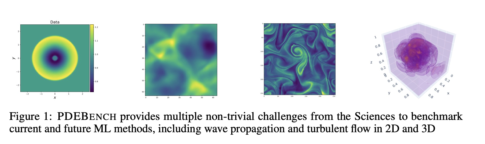
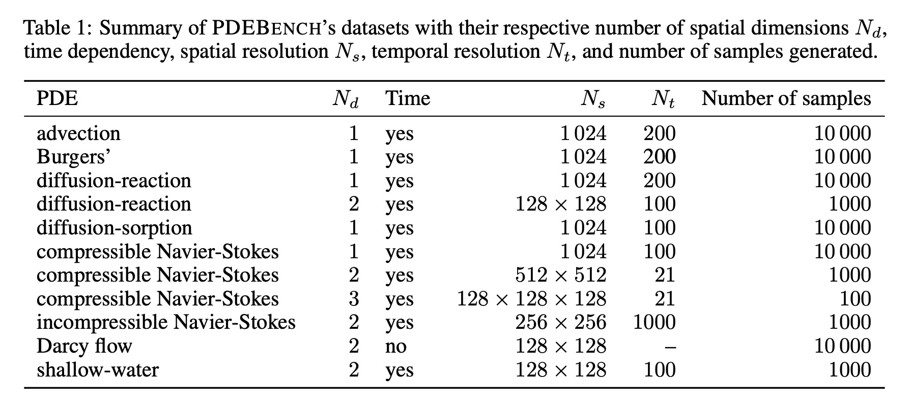

# DISC-498-Project

# Diffusion for PDE 

Jiuzhou Chen， Dongwei Shi

(figure from [PDEBench Paper](https://proceedings.neurips.cc/paper_files/paper/2022/file/0a9747136d411fb83f0cf81820d44afb-Paper-Datasets_and_Benchmarks.pdf) given by Takamoto et.al.)

## Data Generation

All training and test datasets can be downloaded from [PDEBench Github](https://github.com/pdebench/PDEBench) and link of [dataset]( https://darus.uni-stuttgart.de/dataset.xhtml?persistentId=doi:10.18419/darus-2986)

A formal table to summarize PDE types and grids from PDE Bench Paper：

## Train Diffusion Models

## Forward and Backward Simulation Problem

### ODE/PDE Discovery Problem
One potential goal of our project is, given PDE data (possibly with only partial observations available), to discover the underlying physical law (the PDE), particularly identifying the differential terms and their corresponding coefficients. Specifically, we aim to explore whether existing methods can be extended to handle scenarios with varying coefficients.

## License

